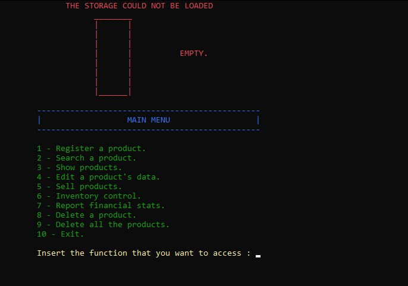

# Trabalho_Final_APC2-LAB2

Um simples sistema de supermercado desenvolvido em C.

## Descrição

Este trabalho final aborda conceitos de APC2 e LAB2, tais como alocação dinâmica, arquivos, ponteiros, estruturas e funções. Estes temas foram utilizados para criar um sistema de supermercado com suporte a busca, registro, remoção, venda de produtos, controle de estoque e etc.

## Desenvolvedores

* Matheus Rondón Fernandes Cardoso
* Paulo César de Morais Sousa

## Imagem ilustrativa

